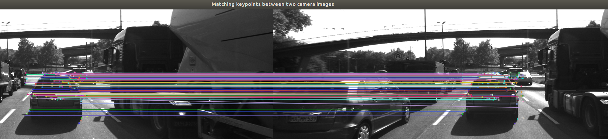
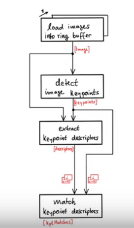

### Camera based 2D Feature Tracking
#### Build a collision detection system with a mono camera

The target of this project is to evaluate :
* The differents methods to track the features
* The descriptors extraction methodes
* The performance of the matching methodes (criterion : execution time for the keypoint detection and descriptor extraction, number of matching keypoints with the combinations of detectors and descriptors). 

### Vocabulary 

* A keypoint (interest point) detector is an algorithm that chooses points from an image based on a local maximum of a funtion.
* A descriptor is a vector of values, which describes the image patch around a keypoint. 

### SW Architecture
 
#### Overview

#### Load Images into into ring buffer
        int dataBufferSize = 3;       // no. of images which are held in memory (ring buffer) at the same time
        // push image into data frame buffer
        DataFrame frame;
        frame.cameraImg = imgGray;
        
        if (dataBuffer.size()>dataBufferSize)
            {
                dataBuffer.erase(dataBuffer.begin());
                dataBuffer.push_back (frame);
                cout << "buffer full, oldest image deleted and new image added in the buffer " <<endl;
            }
        else
            {
                dataBuffer.push_back (frame);
                cout << "buffer not full, new image accepted " <<endl;
            }

        //// EOF STUDENT ASSIGNMENT
        cout << "#1 : LOAD IMAGE INTO BUFFER done" << endl;

#### Keypoints detection in the image with 2 methodes + Box around the preceding vehicle :
* Intensity gradient detectors (Harris and Shi Tomasi)
* Fast detectors (FAST, BRIEF, ORB.....)

        /* DETECT IMAGE KEYPOINTS */
        // add the following keypoint detectors in file matching2D.cpp and enable string-based selection based on detectorType
        // extract 2D keypoints from current image
        vector<cv::KeyPoint> keypoints; // create empty feature list for current image
        string detectorType = "SHITOMASI";
        //string detectorType = "HARRIS";
        //string detectorType = "FAST";
        //string detectorType = "BRISK";
        //string detectorType = "ORB";
        //string detectorType = "AKAZE";
        //string detectorType = "SIFT";
        
        if (detectorType.compare("SHITOMASI") == 0) //SHITOMASI
        {
            detKeypointsShiTomasi(keypoints, imgGray, false); 
        }
        else if (detectorType.compare("HARRIS") == 0) // HARRIS
        {
            detKeypointsHarris(keypoints, imgGray, false);
        }
        else
        {
            detKeypointsModern(keypoints, imgGray, detectorType, false); // FAST, BRISK, ORB, AKAZE, SIFT
        }
 
The function detKeypointShitomasi() for the Shi Tomasi algorithm is defined in the module matching2D_Student.cpp.   
The function detKeypointHarris() for the Harris algorithm is defined in the module matching2D_Student.cpp.   
The function detKeypointsModern() for the new algorithms is defined in the module matching2D_Student.cpp.      

This code for the specifics Keypoint selection is below:

         /*only keep keypoints on the preceding vehicle*/
        
        bool bFocusOnVehicle = true;
        cv::Rect vehicleRect(535, 180, 180, 150);
        if (bFocusOnVehicle)
		{
            // Result Vectors with the keypoint selected 
            vector<cv::KeyPoint> keypointsInside;
            // for every iteration in the loop, we list the 2D keypoints of the current image
			for ( auto keyPoint : keypoints){ // for every keypoint in the vector                                               
					if (vehicleRect.contains(keyPoint.pt)) // test if the keypoint is located in the rectangle 
						keypointsInside.push_back(keyPoint); // add the keypoint in the list if the keypoint is located in the rectangle
                        } 
			keypoints = keypointsInside; 
            cout << "local keypoints n= " << keypoints.size()<<" keypoints" <<endl; // Keypoints detected for every image (rectangle area : preceding car)
		} 

 
You can find the results in this picture (after the keypoint selection with the FAST algorithm) : 

#### Keypoints extraction with the descriptors (bouding box around the keypoints) : 
* HOG family as the SIFT (Scale Invariant Feature Transform) 
* Binary Descriptors family as the BRISK (Binary Robust Invariant Scalable Keypoints

       /* EXTRACT KEYPOINT DESCRIPTORS */
        // add the following descriptors in file matching2D.cpp and enable string-based selection based on descriptorType
        // -> BRIEF, ORB, FREAK, AKAZE, SIFT

        cv::Mat descriptors;
        string descriptorType = "BRISK"; // BRISK 
        //string descriptorType = "BRIEF"; // BRIEF
        //string descriptorType = "ORB"; //ORB
        //string descriptorType = "FREAK"; //FREAK
        //string descriptorType = "AKAZE"; //AZAKE
        //string descriptorType = "SIFT"; //SIFT
        descKeypoints((dataBuffer.end() - 1)->keypoints, (dataBuffer.end() - 1)->cameraImg, descriptors, descriptorType);
        

        // push descriptors for current frame to end of data buffer
        (dataBuffer.end() - 1)->descriptors = descriptors;

        cout << "#3 : EXTRACT DESCRIPTORS done" << endl;

The function "descKeypoints()" for the extraction of the descriptors is defined in the module matching2D_Student.cpp. 

#### Keypoints descriptors matching between 2 sequential images from a mono camera with two methods : 
* BFM (Brute force matching)
* FLANN (Fast library for approximate nearest neighbors) with the KD-Tree data structure.

        if (dataBuffer.size() > 1) // wait until at least two images have been processed
        {

            /* MATCH KEYPOINT DESCRIPTORS */
            vector<cv::DMatch> matches;
            string matcherType = "MAT_FLANN";        // MAT_BF, MAT_FLANN
            string descriptorType = "DES_BINARY"; // DES_BINARY, DES_HOG
            string selectorType = "SEL_KNN";       // SEL_NN, SEL_KNN

            //// FLANN matching in file matching2D.cpp
            //// KNN match selection and perform descriptor distance ratio filtering with t=0.8 in file matching2D.cpp

            matchDescriptors((dataBuffer.end() - 2)->keypoints, (dataBuffer.end() - 1)->keypoints,
                             (dataBuffer.end() - 2)->descriptors, (dataBuffer.end() - 1)->descriptors,
                             matches, descriptorType, matcherType, selectorType);
            
            

            // store matches in current data frame
            (dataBuffer.end() - 1)->kptMatches = matches;

            cout << "#4 : MATCH KEYPOINT DESCRIPTORS done" << endl;

The FLANN mtching and the KNN match selection are implemented in "MatchDescriptors ()" in matching2D.cpp :

You can find the results in this picture (FLANN algorithm) : 

#### 2 .cpp file are useful :
* 'Matching2D_Student.cpp' + 'matching2D.hpp' : 
  - Detection Keypoints functions (Harris+ Shi Tomasi + Modern methods), 
  - Descriptor function to extract the keypoint and the descriptors, 
  - Matching function from 2 images from the same camera

* 'MidTermProject_Camera_Student.cpp' : main programm : the functions are called one by one as defined in the software architecture 

## Dependencies for Running Locally
* cmake >= 2.8
  * All OSes: [click here for installation instructions](https://cmake.org/install/)
* make >= 4.1 (Linux, Mac), 3.81 (Windows)
  * Linux: make is installed by default on most Linux distros
  * Mac: [install Xcode command line tools to get make](https://developer.apple.com/xcode/features/)
  * Windows: [Click here for installation instructions](http://gnuwin32.sourceforge.net/packages/make.htm)
* OpenCV >= 4.1
  * This must be compiled from source using the `-D OPENCV_ENABLE_NONFREE=ON` cmake flag for testing the SIFT and SURF detectors.
  * The OpenCV 4.1.0 source code can be found [here](https://github.com/opencv/opencv/tree/4.1.0)
* gcc/g++ >= 5.4
  * Linux: gcc / g++ is installed by default on most Linux distros
  * Mac: same deal as make - [install Xcode command line tools](https://developer.apple.com/xcode/features/)
  * Windows: recommend using [MinGW](http://www.mingw.org/)

## Basic Build Instructions

1. Clone this repo.
2. Make a build directory in the top level directory: `mkdir build && cd build`
3. Compile: `cmake .. && make`
4. Run it: `./2D_feature_tracking`.
