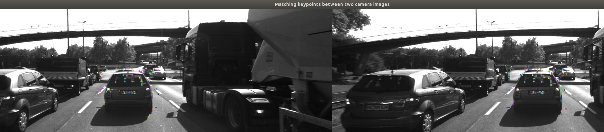

### Camera based 2D Feature Tracking
#### Build a collision detection system with a mono camera
## ----------------------------------------

The target of this project is to evaluate :
* The differents methods to track the features
* The descriptors extraction methodes
* The performance of the matching methodes (criterion : execution time for the keypoint detection and descriptor extraction, number of matching keypoints with the combinations of detectors and descriptors). 

### Vocabulary 

* A keypoint (interest point) detector is an algorithm that chooses points from an image based on a local maximum of a funtion.
* A descriptor is a vector of values, which describes the image patch around a keypoint. 

### SW Architecture
 
#### Overview

#### Load Images into into ring buffer

#### Keypoints detection in the image with 2 methodes + Box around the preceding vehicle :
* Intensity gradient detectors (Harris and Shi Tomasi)
* Fast detectors (FAST, BRIEF, ORB.....)

#### Keypoints extraction with the descriptors (bouding box around the keypoints) : 
* HOG family as the SIFT (Scale Invariant Feature Transform) 
* Binary Descriptors family as the BRISK (Binary Robust Invariant Scalable Keypoints

#### Keypoints descriptors matching between 2 sequential images from a mono camera with two methods : 
* BFM (Brute force matching)
* FLANN (Fast library for approximate nearest neighbors) with the KD-Tree data structure.

#### 2 .cpp file are useful :
* 'Matching2D_Student.cpp' + 'matching2D.hpp' : 
  - Detection Keypoints functions (Harris+ Shi Tomasi + Modern methods), 
  - Descriptor function to extract the keypoint and the descriptors, 
  - Matching function from 2 images from the same camera

* 'MidTermProject_Camera_Student.cpp' : main programm : the functions are called one by one as defined in the software architecture 

## Dependencies for Running Locally
* cmake >= 2.8
  * All OSes: [click here for installation instructions](https://cmake.org/install/)
* make >= 4.1 (Linux, Mac), 3.81 (Windows)
  * Linux: make is installed by default on most Linux distros
  * Mac: [install Xcode command line tools to get make](https://developer.apple.com/xcode/features/)
  * Windows: [Click here for installation instructions](http://gnuwin32.sourceforge.net/packages/make.htm)
* OpenCV >= 4.1
  * This must be compiled from source using the `-D OPENCV_ENABLE_NONFREE=ON` cmake flag for testing the SIFT and SURF detectors.
  * The OpenCV 4.1.0 source code can be found [here](https://github.com/opencv/opencv/tree/4.1.0)
* gcc/g++ >= 5.4
  * Linux: gcc / g++ is installed by default on most Linux distros
  * Mac: same deal as make - [install Xcode command line tools](https://developer.apple.com/xcode/features/)
  * Windows: recommend using [MinGW](http://www.mingw.org/)

## Basic Build Instructions

1. Clone this repo.
2. Make a build directory in the top level directory: `mkdir build && cd build`
3. Compile: `cmake .. && make`
4. Run it: `./2D_feature_tracking`.